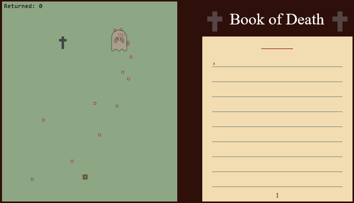

# 2022 JS13K Submission - Book of Death



**Controls**
- Arrow Keys: move around
- Space and Letters: write into the notebook
- Enter: go to next line / next page

**Description**  
*Book of Death* is a bullet hell game where your goal is to return lost souls
back to the realm of death. You can do this by writing the names of the dead into
your book of death. This book is inspired by the Book of the Dead, which is part of the 
ancient Egypt. 

Submission: https://js13kgames.com/entries/book-of-death

## Resources

- kontra.js >= 8.0.0
- rollup
- [soundbox](https://sb.bitsnbites.eu/)

The current implementation requires a linux/git cmd to run the [inline-html.sh](inline-html.sh) file. Please change if
you work in another environment.

All graphics and sounds were created by the authors.

## Commands

Development
```
npm run serve
```

Build
```
npm run build
```

## Authors

- [Christian Staudte](https://github.com/t4khosu)
- [Tim Streicher](https://github.com/coronoro)

- Forked from [wil92's repository](https://github.com/wil92/js13games-boilerplate) 
- Additional code used from [jvalecillos' repository](https://github.com/jvalecillos/js13k-rollup-starter)

## License

[LICENSE](./LICENSE.md)
